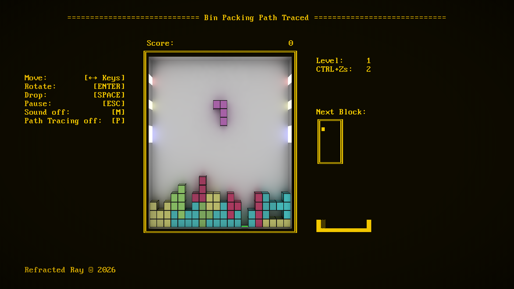

# Bin Packing Path Traced

A comprehensive study of block placement strategies under time pressure, with path tracing.

 The path are traced, the bins are being packed. Wild stuff.

## Binaries

Binary executable can be found in the **bin*** folder. Make sure to keep the accompanying **stuff.bin** file around.

## Build Instructions
For the first build, **run the Visual Studio as an Administrator**. Build process will create symbolic links to folder with shaders, which can fail on some systems if VS is run without administrator rights.

* Run `cmake` on the *src* subfolder and build the generated project
* Or run provided file `create_vs_project.bat` and build the project generated in the *vsbuild* subfolder (requires Visual Studio 2022)

### Troubleshooting
If you get an error *Error: failed to get shader blob result!*, it most likely means that build didn't create a symbolic link for shaders folder in the build directory and executable can't find shader files. To fix this, run Visual Studio as administrator, clean the solution and run the build again.

## 3rd Party Software

This project uses following dependencies:
* [d3dx12.h](https://github.com/Microsoft/DirectX-Graphics-Samples/tree/master/Libraries/D3DX12), provided with an MIT license. 
* [STB library](https://github.com/nothings/stb/), provided with an MIT license.
* [DXC Compiler](https://github.com/microsoft/DirectXShaderCompiler), provided with an University of Illinois Open Source
* [GLM library](https://github.com/g-truc/glm), provided with an MIT license.
